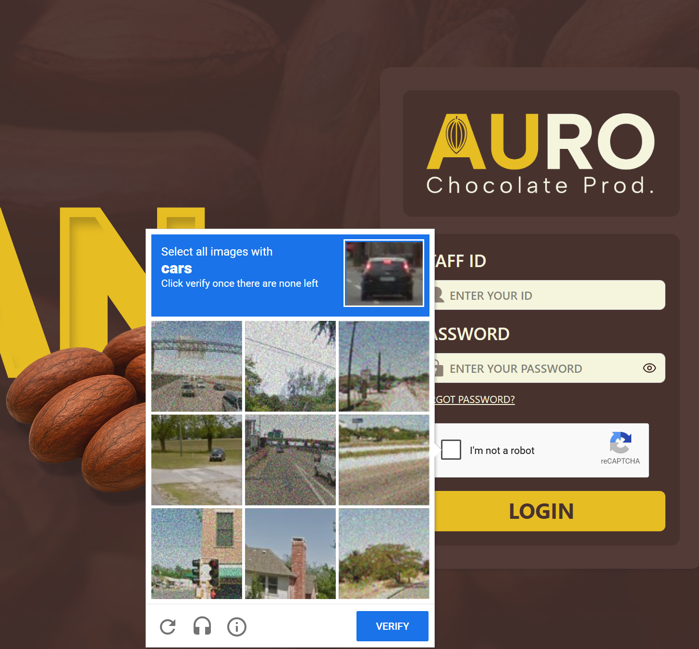
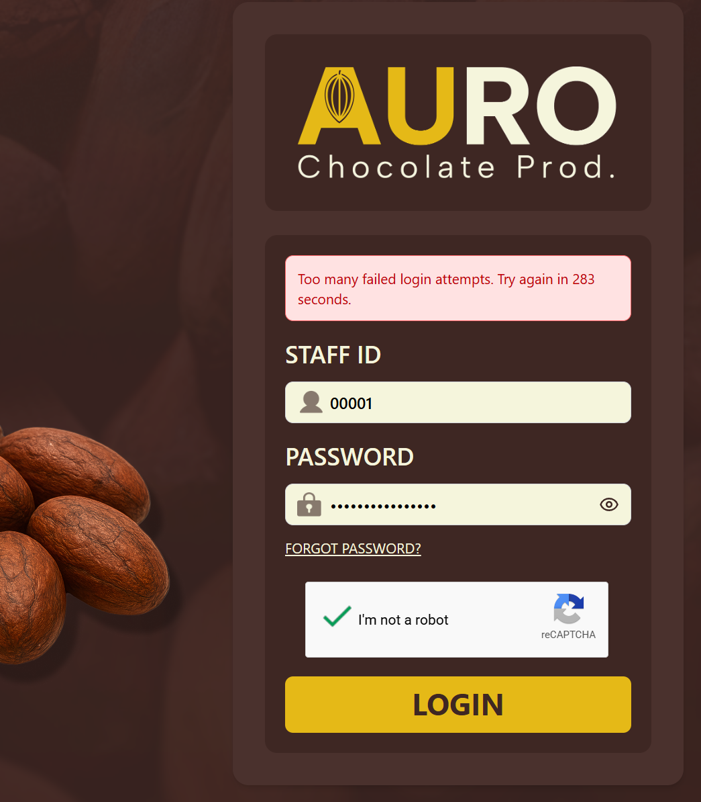
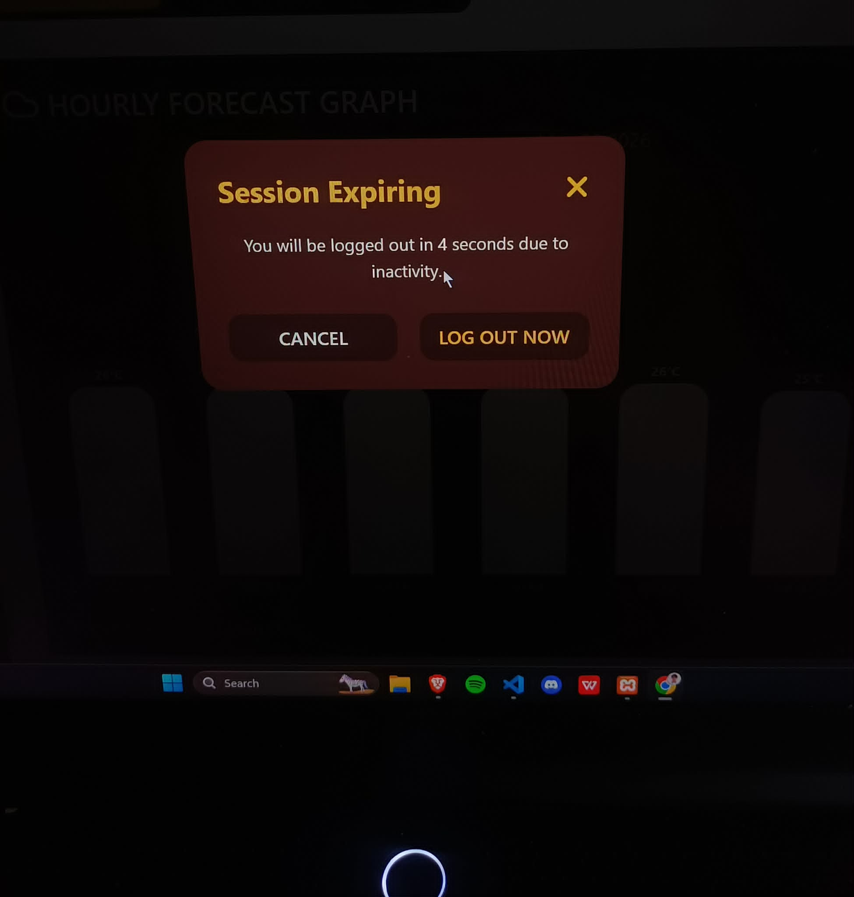
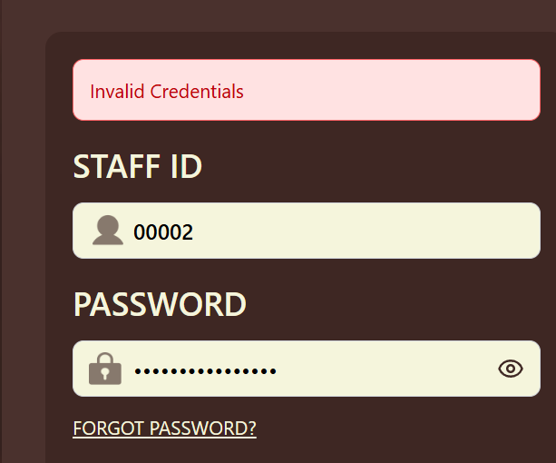

## APPLYING BASIC/SIMPLE SECURITY CONTROL IN CACAO PROCESSING MANAGEMENT SYSTEM

1: Bot Protection via Google reCAPTCHA

2: Account Lockout

3: Idle Session Logout

4: Secure Error Handling

5: No-Cache Data Protection

- This one makes the "back button" after logging out wont go back inside the system, deleting every session cache after the user logouts.
